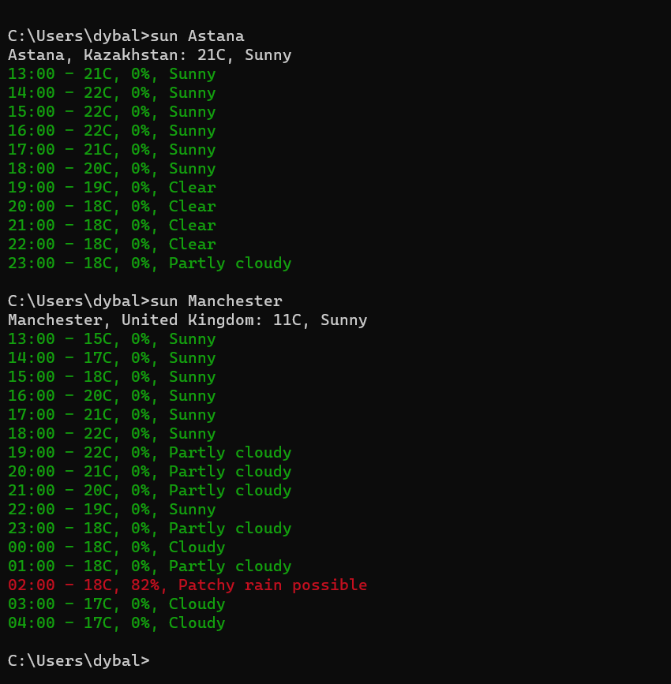

# Weather
 CLI application to get the information about today's weather.\
 Application is implemented by using Golang, and the next tools:\
 Weather API - https://www.weatherapi.com/ \
 Color package for Golang - https://github.com/fatih/color

# Example:
 

# How to install:
 Download the file into your Windows device, and unpack it anywhere you want.\
 Copy the your local link to the folder, and go to **This pc** -> **Properties** -> **Advanced system settings** -> **Environment variables** -> **Path** -> **Click on "New" button and paste the link of your folder**.\
 Restart your device.

 # How to use:
  Open command line, and type **sun s**, where **s** is the name of the city.
